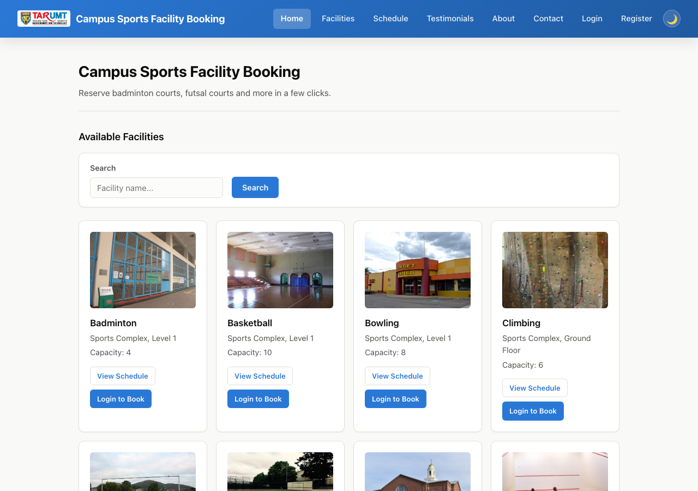
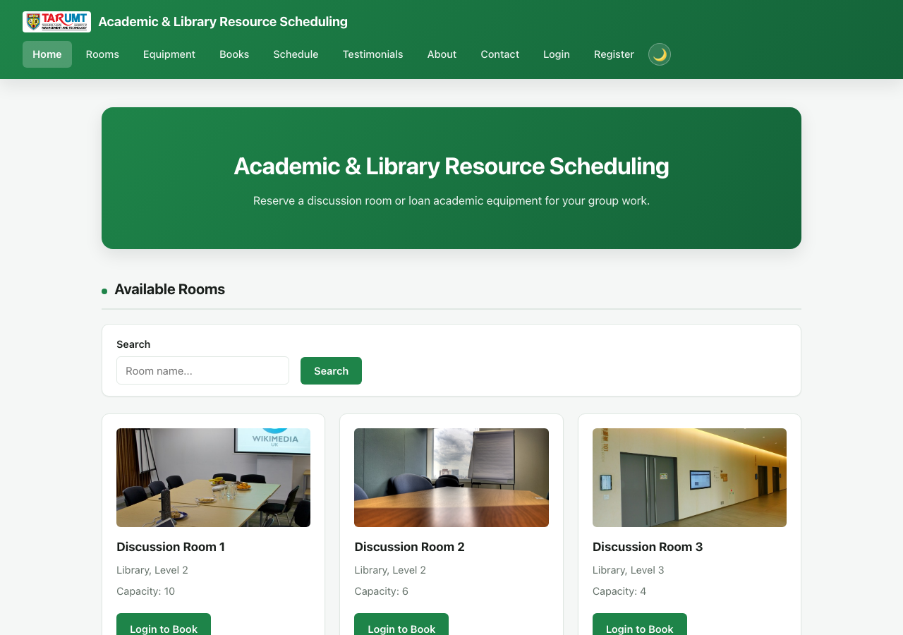
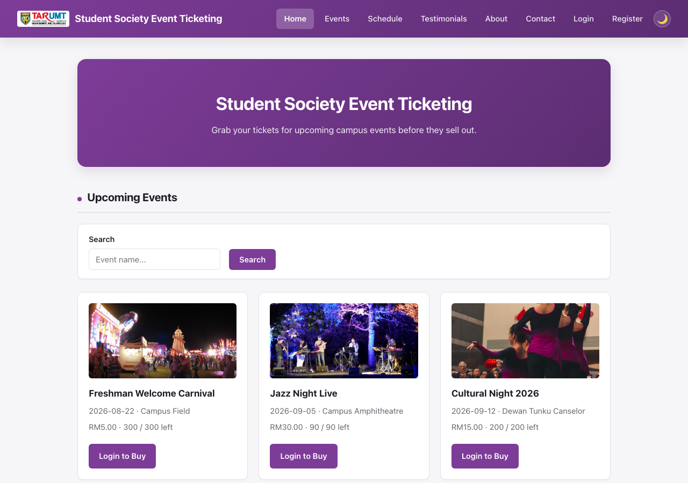
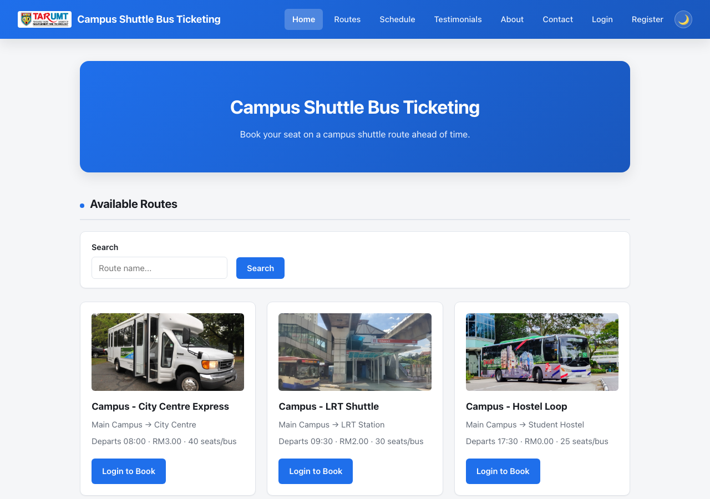
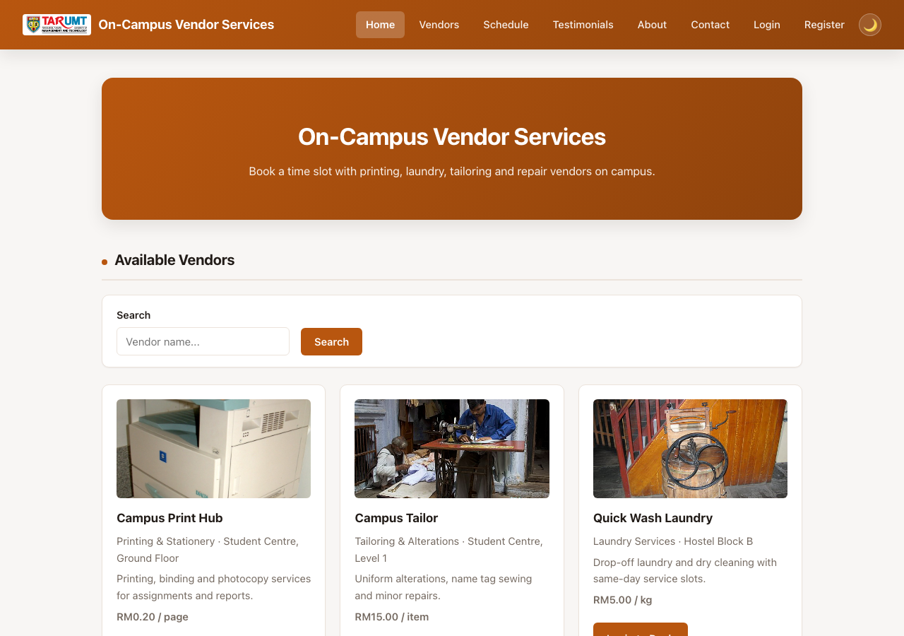

# Booking & Ticketing Sample Code (AMIT3253)

Five independent, minimal PHP + MySQL CRUD applications, one per booking/ticketing
scenario from the assignment brief. Pick the folder that matches your chosen scenario,
copy it as-is, and use it as your Phase 2/3 starting point so you can focus on the AWS
infrastructure (VPC, EC2, RDS, ELB, ASG) rather than writing app code from scratch.

**Each student/group builds only one of these five folders** — they don't need to read
or reference the others.

| Folder | Scenario | Main entity |
|---|---|---|
| `sports-facility-booking/` | Campus Sports & Facilities Amenities | Facility bookings |
| `library-resource-scheduling/` | Academic & Library Resource Scheduling | Room bookings, equipment loans, book loans |
| `event-ticketing/` | Student Society & Event Ticketing | Event ticket orders (general admission or assigned seating), with QR check-in |
| `shuttle-bus-ticketing/` | Campus Shuttle Bus & Transport Ticketing | Shuttle route tickets |
| `vendor-services-booking/` | On-Campus Commercial & Vendor Services | Vendor service slot bookings with a price estimate |

## Screenshots

| | |
|---|---|
| **Sports Facility Booking**<br> | **Library Resource Scheduling**<br> |
| **Event Ticketing**<br> | **Shuttle Bus Ticketing**<br> |
| **Vendor Services Booking**<br> | |

Each folder is self-contained:

- `schema.sql` — creates the database, tables (including a `users` table), and seed data.
- `config.php` — database connection (mysqli). Reads `DB_HOST`, `DB_USER`, `DB_PASS`,
  `DB_NAME` from environment variables, falling back to local defaults. Also sets the
  PHP and MySQL timezone to `Asia/Kuala_Lumpur` (UTC+8) — the server's OS clock defaults
  to UTC both locally and on a stock EC2 instance, which is 8 hours behind Malaysia time.
- `auth.php` — session helpers: `current_user_id()`, `current_user_name()`,
  `current_user_is_admin()`, `require_login()`, `require_admin()`.
- `register.php` / `login.php` / `logout.php` — account creation and session login.
  Passwords are hashed with `password_hash()`/`password_verify()`, never stored in
  plaintext. Required fields are marked with a red asterisk.
- `partials/header.php` / `partials/footer.php` — shared navbar/page chrome, included by
  every page so the layout stays consistent.
- `index.php` — public landing page: browse facilities/rooms/events/routes/vendors as
  cards, plus a "My Bookings"/"My Orders" section for the logged-in user.
- `create.php` — form + insert (create). Requires login; the record is tied to the
  logged-in user's `user_id`.
- `edit.php` — form + update (update). Requires login and ownership (a user can only
  edit their own bookings/orders).
- `delete.php` — delete, requires login and ownership.
- `style.css` — shared styling (navbar, hero banner, card grid, forms, tables, dark/light
  mode).

All queries use prepared statements (`mysqli::prepare` / `bind_param`) and all output is
escaped with `htmlspecialchars()`, so these are safe patterns to reuse elsewhere in your
project, not just toy code.

### A note on authentication and the assignment brief

The assignment's own assumptions explicitly state the ticketing site "is publicly
accessible to end-users without requiring a user login, registration, or authentication
gateway" — login/registration is **not** required to satisfy the "Functional" rubric
criterion. It's included here anyway because it makes the demo look and feel like a real
product (per-user bookings, a proper nav bar, etc.), and it's a reasonable "advanced
feature" to point to in the Part 2 demonstration if your group wants to go beyond the
minimum. If you'd rather keep things simpler, you can delete `auth.php`, `register.php`,
`login.php`, `logout.php`, the `require_login()` calls, and the `user_id` column/joins —
the CRUD logic underneath is unaffected either way.

## Baseline features (all five folders)

Every folder ships more than bare CRUD out of the box:

- **Full admin panel** (`admin/`, gated by an `is_admin` flag on `users`, admins land
  directly on an admin page, never the public site): CRUD for the main bookable entity,
  CRUD/cancel for *any* user's bookings, moderating testimonials, viewing contact
  messages, and **user account management** — promote/demote admin access, delete an
  account (cascades to all of that user's bookings/orders/tickets/testimonials in one
  transaction), or create a brand-new admin account directly without that person
  self-registering first. An admin can never delete or demote their own account.
- **Double-booking / overselling prevention that's concurrency-safe**, not just a
  same-request check: the relevant row is locked (`SELECT ... FOR UPDATE`) and the
  existing count is compared against capacity inside a transaction before inserting, so
  two people submitting at the same instant can't both slip past a full slot. Depending
  on the resource, this is either an exclusive "one booking per slot" constraint (sports
  courts, library rooms) or a real capacity check (library equipment, shuttle seats,
  vendor slots, event tickets/seats).
- **You can't even select something that's full or in the past.** Every booking form's
  date field defaults to today; time slots (or routes, or events) that are already fully
  booked, closed, or have already passed today are greyed out and disabled in the
  dropdown *before* you submit — via a small JSON endpoint the form fetches when the
  date/resource changes (e.g. `slot_availability.php`), not just a server-side rejection
  after the fact. The server-side check still exists underneath as the real
  authority — the greying-out is a UX layer on top of it, not a replacement for it.
- A seeded admin account: **admin@example.com / admin123**. Change this password (or the
  seed row) before using this anywhere but a local demo — it's a well-known credential
  once this code is shared.
- A plain "Admin" link/menu appears in the navbar only when `current_user_is_admin()` is
  true.

This baseline is deliberately minimal in a few specific ways — no admin dashboard/stats
page, no separate "category" management layer above the main entity, and no editable
"system information" content (About/contact text is hardcoded). Those are left as
exercises for students who want to go further; see "Extending for extra marks" below.

## What each folder adds beyond the baseline

- **`sports-facility-booking/`** — Facilities vs. courts: a facility is a sport/category
  (e.g. "Badminton"), a court (FK to facility) is the specific bookable instance (e.g.
  "Court A"/"Court B"). Time slots are a fixed reference table, not free text.
  **`schedule.php`** shows a grid (time slots × courts) of Available/Booked/Booked by
  you/Closed for a chosen facility+date, linking straight into a pre-filled booking
  form. Admins can mark a court closed for a slot or a whole day (`closures` table), and
  `admin/schedule.php` shows the same grid with the actual booker's name/email instead
  of just "Booked". Adding a brand-new sport needs zero code changes — just new rows.
- **`library-resource-scheduling/`** — Three resource types in one app: **rooms** (date +
  time-slot bookings, exclusive), **equipment** (date + time-slot + quantity loans,
  capacity-based against `total_units`, with a late-return fine of RM0.50 per 30 minutes
  past a 30-minute grace period), and **books** (a fixed 2-week loan period, checkout
  date always today, with a late fine of RM0.50/day). Fines are only ever marked "paid"
  by an admin, never self-service. `admin/schedule.php` shows the room-booking grid with
  borrower identity.
- **`event-ticketing/`** — Events can optionally have **assigned seating**: a seat map
  (rows × seats-per-row) an admin sets at creation, with a live seat picker for buyers
  (`seat_select.php`) instead of just a quantity. Every ticket purchased (one per seat,
  or one per unit for general-admission events) gets its own **QR code** on the
  confirmation page, generated entirely client-side (no external service call — see
  `assets/js/qrcode.js`). The QR encodes a random opaque token, **not** the attendee's
  personal info, so a photographed/glimpsed code can't leak anything — `admin/checkin.php`
  looks up the attendee/event/seat from that token and marks them present, safely
  idempotent if scanned twice.
- **`shuttle-bus-ticketing/`** — Book a route by travel date + seat count; price is
  seats × the route's per-seat price. Seat capacity is checked against `total_seats`
  (capacity-based, multiple people can share a route/date). A route that's already
  departed today can't be booked for today either.
- **`vendor-services-booking/`** — Each vendor has a `price_per_unit`/`unit_label` (e.g.
  RM0.20/page, RM5.00/kg) shown on every vendor card, and the booking form shows a
  live-computed price estimate as you set a quantity — deliberately **not** a real
  checkout like `event-ticketing/payment.php`, since these are real-world
  pay-on-collection services. Each vendor also has a `capacity` (how many students it
  can serve in the same slot), since unlike a single-facility booking, a vendor
  realistically isn't limited to one customer per slot.

If you want a feature from one folder in a different one (e.g. the schedule-grid pattern,
or QR ticketing), it's a straightforward port — swap the entity/field names and follow
the same query/render pattern. None of this is framework magic; it's the same plain
PHP + mysqli approach throughout.

## Photo uploads: local disk by default, S3 already wired up (just needs your bucket)

Every folder's main entity (`facilities`, `rooms`/`equipment`/`books`, `events`,
`routes`, `vendors`) has an `image_url` column. The relevant admin create/edit form has
a real `<input type="file">`, handled by an image-upload helper in `helpers.php`: it
validates the upload is actually an image (via `getimagesize()`, not just the
extension) and caps it at 5MB. Where it's *stored* depends on `AWS_S3_BUCKET` in
`config.php`:

- **Unset (the default)** — saved into the local `uploads/` folder under a
  server-generated filename, `image_url` stores a root-relative path like
  `/uploads/xxx.jpg`. Nothing to configure; this is what you get out of the box.
- **Set** — uploaded to that S3 bucket instead (Signature Version 4 signed requests,
  hand-written with PHP's built-in stream wrapper — no AWS SDK, no Composer), and
  `image_url` stores the full `https://` object URL instead. `` rendering and the
  "No photo yet" placeholder work identically either way; only where the bytes
  physically live changes.

**This doesn't move anything already stored.** Each app's seed data (in `schema.sql`)
already has demo photos saved as local `/uploads/...` paths, and any photo uploaded
before `AWS_S3_BUCKET` was set is the same — switching S3 on only changes where the
*next* upload/replace goes, it doesn't rewrite existing rows to point at S3. Migrating
existing local images over isn't built here; that's left as an exercise.

**Credentials — two ways, tried in this order:**
1. **An IAM role attached to the EC2 instance/launch template** (`s3:PutObject` +
   `s3:DeleteObject` on the bucket) — credentials are fetched automatically at request
   time from the instance's own metadata service, nothing hardcoded anywhere. This is
   the normal AWS way to do it.
2. **Explicit temporary credentials**, for AWS Academy Learner Labs where you can't
   attach or even inspect IAM roles yourself: copy the Access Key ID / Secret Access
   Key / Session Token from the lab's "AWS Details" panel and set them as
   `AWS_ACCESS_KEY_ID` / `AWS_SECRET_ACCESS_KEY` / `AWS_SESSION_TOKEN`. Each app loads
   these from a `.env` file in its own folder (copy `.env.example` to `.env`, fill in
   the values — `config.php` reads it automatically, see the loader at the top of the
   file), or you can set them as Apache environment variables instead if you'd rather
   not use a file. Never hardcode them directly in `config.php` — **this repo is
   public**, and a committed key gets scraped within minutes; `.env` itself is
   git-ignored so it's never committed either. These are genuinely temporary and
   **expire and rotate periodically** — if uploads that were working suddenly start
   failing, that's almost always why; grab fresh values and update `.env` (no restart
   needed) or the environment variable.

**Why this matters for ASG specifically**: once there's more than one EC2 instance
behind the ALB, a photo saved to local disk only exists on whichever instance happened
to handle that upload — any other instance (or a newly launched ASG instance) shows a
broken image for it. That's not a hypothetical; it's guaranteed the moment the ASG has
≥2 instances, since uploading a photo through the admin panel is a normal part of using
these apps. S3 fixes this by giving every instance the same shared storage to read from.

**What you still have to do yourself** (this is the "extra marks" part): create the S3
bucket and a bucket policy allowing public `s3:GetObject` (or put CloudFront in front of
it instead), get credentials working one of the two ways above, and set
`AWS_S3_BUCKET`/`AWS_S3_REGION`. None of that can be done from inside this codebase —
it's real AWS console/IAM work.

**A note on how confident to be in this:** the SigV4 signing logic is verified
byte-for-byte against AWS's own published test vectors, and the "not configured" (local
disk) path has been tested live through every app's actual admin upload/display/delete
flow. With fake credentials, a signed request was sent all the way to a real S3 endpoint
and came back with a proper `403` — confirming the request-building/signing pipeline
genuinely reaches AWS and gets a structured response, not a crash or hang. What hasn't
been tested is a full successful round-trip against a real bucket with real, valid
credentials — there isn't one available to test that specific case here. Treat the
"can it talk to S3 correctly" part as verified, and the "does it work with your actual
bucket and role" part as unverified until you've tried it yourself.

Note: `uploads/` needs to be writable by the web server user (e.g. `apache` on EC2) —
`chmod 775 uploads` (or adjust ownership) after copying the app to `/var/www/html/`.

Also check PHP's own upload limits — the stock default is often `upload_max_filesize = 2M`,
smaller than the 5MB this app allows, so a normal phone photo can get rejected by PHP
itself before this app's code ever runs (shows as "Image upload failed"). Bump it in
`php.ini` (find it with `php --ini`) or the Apache/php-fpm config:
```
upload_max_filesize = 10M
post_max_size = 12M
```
then restart the web server (`sudo systemctl restart httpd`, or `php-fpm` if that's how
PHP is running).

## Phase 1: planning the design and estimating cost

This phase has no code — nothing in this repo does it for you. Per the assignment
brief: produce an architecture diagram (AWS Architecture Icons / a reference
architecture as a starting point), a solution overview diagram of the end-user journey
and data flow through whichever scenario you picked, and a 12-month cost estimate for
the `us-east-1` region using the AWS Pricing Calculator. Do this before touching the
lab environment — it's meant to inform the VPC/EC2/RDS choices you make in Phases 2
and 3 below, not follow from them.

## Phase 2: running it on a single EC2 instance

1. Launch an EC2 instance (Amazon Linux 2023), install a LAMP stack:
   ```
   sudo dnf install -y httpd php php-mysqli mariadb105-server
   sudo systemctl enable --now httpd mariadb
   ```
2. Secure MySQL/MariaDB and create a DB user, then import the schema:
   ```
   mysql -u root -p < schema.sql
   ```
3. Copy the chosen folder's contents into `/var/www/html/`.
4. Edit `config.php` (or export `DB_HOST`/`DB_USER`/`DB_PASS`/`DB_NAME` in your Apache
   environment) to match your local MySQL credentials.
5. Open the instance's public IPv4 address in a browser to test.

## Phase 3: moving the database to RDS

1. Create an RDS MySQL instance in a private subnet (per the assignment's VPC design).
2. From an EC2 instance in the same VPC, run the folder's `schema.sql` against the RDS
   endpoint:
   ```
   mysql -h <rds-endpoint> -u <user> -p < schema.sql
   ```
3. Set `DB_HOST` (and `DB_USER`/`DB_PASS`/`DB_NAME` if different from the defaults) on the
   web server to the RDS endpoint — `config.php` does not need to change.
4. Restrict the RDS security group to only accept traffic from the web/app tier's
   security group, on port 3306.

## Sessions across multiple instances (ALB + ASG)

The "Scalability" and "Load Balanced" deliverables require an Auto Scaling Group behind
an Elastic Load Balancer — once there's more than one EC2 instance running the app,
**PHP's default session storage breaks**. By default a session is written to a file on
the local disk of whichever instance handled that request; the ALB has no reason to send
a user's *next* request to that same instance, so the next instance sees no session at
all — the user looks logged out, "My Bookings" appears empty, flash messages vanish,
mid-way through using the site, for no visible reason. This isn't a corner case — it's
guaranteed to happen under the load test in the "High Performing" deliverable, once
traffic is actually spread across instances.

**This is already handled** in every folder here: sessions are stored in the database
instead of on local disk (a `sessions` table in `schema.sql`, a `DbSessionHandler` class
wired up via `session_set_save_handler()` at the top of `auth.php`). Every instance
reads/writes the same table via the same RDS connection every other page already uses,
so it doesn't matter which instance an ALB routes a given request to — you don't need to
turn on ALB "stickiness" for login state to keep working. (ALB sticky sessions on their
own aren't a real fix here anyway — they just pin a user to one instance, which breaks
again the moment that specific instance is terminated by an ASG scale-in.) Nothing about
this needs to change when moving from a single EC2 instance to an ASG — it works the
same way with one instance or ten.

## ALB health checks

Each folder has a **`healthz.php`** — point your target group's health check path at it.
It just requires `config.php` and returns `200 OK` if that succeeds. This matters because
`config.php` explicitly sends a `500` status if the database connection fails, instead of
the default `200`; without that, a target whose RDS connection is down would still look
healthy to the ALB and keep receiving real traffic instead of being pulled out of
rotation.

## Extending for extra marks

These apps already cover CRUD, accounts, a real admin panel (including user management),
concurrency-safe double-booking/overselling prevention, and — per folder — a few
scenario-specific features (see above). Ideas for going further, none of which are
implemented yet in any folder:
- An admin dashboard: stats tiles (total bookings/revenue, busiest resource, bookings
  today) plus graphs over time, broken down per resource.
- A booking status workflow (pending/confirmed/done) instead of instant-confirm.
- Live chat between a user and admin (a real-time message thread, not a chatbot) for
  support questions.
- Cap how much a single account can book per day (e.g. max hours, or max seats/tickets),
  so one account can't hog every slot for a popular resource.
- Provision the actual S3 bucket + IAM role for photo uploads and confirm the S3 path
  works end-to-end against a real bucket (see above — the code side is done, the AWS
  side isn't).
- A REST/JSON API layer for load testing tools (Apache Bench, JMeter, Locust) to hit
  directly.
