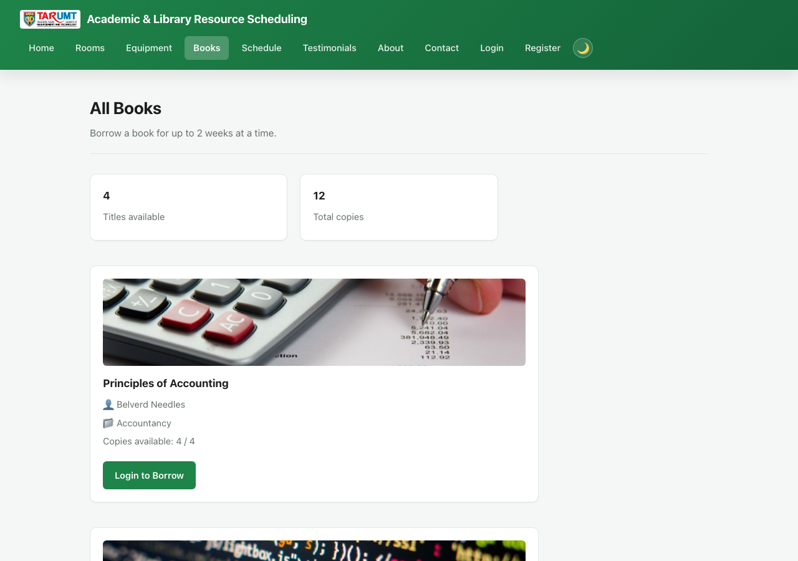
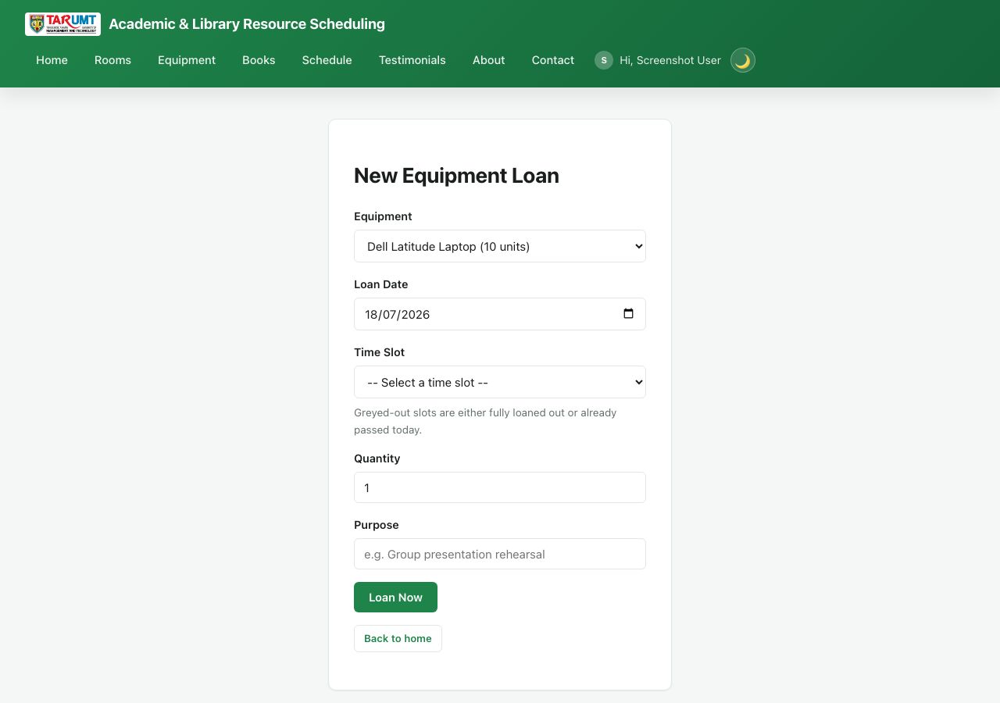

# Academic & Library Resource Scheduling Platform

A minimal PHP + MySQL CRUD web app for the **AMIT3253 Cloud Computing for Business**
capstone assignment. Students browse library discussion rooms and book an hourly
time slot to study in, loan academic equipment (laptops, projectors, calculators)
for a date and time slot, or borrow a physical book for a 2-week loan period. Use
this folder as-is as your Phase 2/3 starting point so you can focus on the AWS
infrastructure (VPC, EC2, RDS, ELB, ASG) instead of writing app code from scratch.


*Homepage — browse rooms, equipment and books, plus "My Bookings".*


*`books.php` — browse the book catalog with copies-available counts.*


*Equipment loan form — fully-loaned-out/past time slots are greyed out before you submit.*

## Features

**Public site**
- Browse rooms as photo cards, with search on the homepage.
- Book a room for a date + time slot, picked from a fixed dropdown of hourly slots
  (not free text). The database enforces a `UNIQUE (room_id, booking_date, time_slot)`
  constraint, so two people can never double-book the same room's slot — the second
  attempt gets a friendly "already booked" error instead of a silent duplicate. The
  time slot dropdown also greys out (and disables) slots that are already booked or
  already passed today as soon as a room and date are picked — a small fetch to
  **`slot_availability.php`** (no page reload).
- Browse equipment (laptops, projectors, calculators, adapters) as photo cards, and
  loan an item for a date + time slot + quantity. "My Equipment Loans" shows each
  loan's status (On Loan / Overdue / Returned) and a Return button. Returning it
  more than 30 minutes after the booked slot's end time incurs a fine (RM0.50 per
  30 minutes, or part thereof, late) — same fine-tracking and admin-only
  mark-as-paid behaviour as book loans, just measured in minutes against a time
  slot instead of days against a due date. The time slot dropdown here greys out
  slots that are fully loaned out (all units taken for that date/slot) or already
  passed today, via **`equipment_availability.php`**.
- Browse books as photo cards, and borrow one for a fixed **2-week loan period**:
  checkout date is today, due date is auto-calculated as today + 14 days. "My Book
  Loans" shows each loan's status (On Loan / Overdue / Returned) and a Return button
  for early returns — no waiting for the due date to pass. An overdue book shows a
  fine (RM0.50/day late, computed against today if still out or the actual return
  date if returned late — so a late return keeps its fine on record instead of it
  disappearing). Only an admin can mark a fine as paid (see below) — a student
  can't waive their own fine.
- Booking/loan date defaults to today and cannot be set in the past (checked both
  in the browser and on the server). For today specifically, time slots that have
  already started are also greyed out and rejected server-side if submitted
  anyway, via the `is_slot_in_past()` helper in `helpers.php`.
- "My Bookings" and "My Equipment Loans" on the homepage, with edit/cancel for your
  own records.
- Register/login/logout, account page, dark/light mode, password visibility toggle,
  TARUMT faculty dropdown at registration.
- Contact form and testimonials (reviews), both moderated by admin.

**Admin panel** (`admin/`, gated by an `is_admin` flag — admins land directly on
`admin/rooms.php`, never the public site)
- Full CRUD for rooms: name, description, capacity, photo.
- Full CRUD for equipment: name, category, description, total units, photo.
- Full CRUD for books: title, author, ISBN, category, total copies, photo.
- View/cancel any user's booking; view every equipment loan (`admin/loans.php`) and
  book loan (`admin/book_loans.php`), mark any of them returned early, and mark an
  overdue fine as paid once the borrower settles it in person.
- **`admin/schedule.php`** — the same per-date "which rooms are booked" view as the
  public site, but admin-only: shows the actual booker's name, email, and purpose
  for each slot (the public version only ever shows "Booked", never who).
- Moderate testimonials and view contact messages.
- Manage user accounts: promote/demote admin access, delete an account (cascades — deleting a user also deletes all of their bookings, equipment loans, book loans, and testimonials in the same transaction, so there's nothing left over to clean up manually), or create a brand-new admin account directly (`admin/user_create.php`) without needing that person to self-register first. An admin can never delete or demote their own account.

There's deliberately **no admin dashboard** (`admin/index.php`) — that's left as an
exercise using the same query/render patterns as the other admin pages. Equipment
availability is concurrency-safe: `loan_create.php`/`loan_edit.php` lock the
equipment row (`SELECT ... FOR UPDATE`) and sum every other loan already placed for
that exact date + time slot before accepting a new one, rejecting it with the exact
number of units still free if it would oversell — the same idea as
`event-ticketing`'s `FOR UPDATE` ticket-inventory lock, adapted for a
date/time-slot-scoped resource instead of a single global pool. Book availability
uses the same lock pattern, but counts currently-unreturned loans
(`book_loans.returned_at IS NULL`) against `total_copies` instead of a per-slot
count, since a book stays "checked out" across its whole 2-week loan period rather
than a single date/time slot.

## Tech stack

Plain procedural PHP (no framework) + MySQL via `mysqli`. All queries use prepared
statements and all output is escaped with `htmlspecialchars()` — these are safe
patterns to reuse elsewhere in your project.

## Requirements

- PHP 8.x with the `mysqli` extension
- MySQL 5.7+ / MariaDB / Amazon RDS (MySQL-compatible)
- A web server (Apache/Nginx) or just `php -S` for local testing

## Quick start (local)

1. Create the database and import the schema (this also seeds an admin account and
   some sample rooms, equipment, and books):
   ```
   mysql -u root -p -e "CREATE DATABASE library_booking_db"
   mysql -u root -p library_booking_db < schema.sql
   ```
2. Point `config.php` at your MySQL instance — either edit the fallback values
   directly, or export environment variables before starting PHP:
   ```
   DB_HOST=localhost DB_USER=root DB_PASS=yourpassword DB_NAME=library_booking_db
   ```
3. Serve the folder, e.g.:
   ```
   php -S localhost:8000
   ```
4. Visit `http://localhost:8000/` for the public site, or log in with the seeded
   admin account below to reach the admin panel.

## Default admin login

```
Email:    admin@example.com
Password: admin123
```

**Change this password (or the seed row in `schema.sql`) before deploying anywhere
beyond a local demo** — it's a well-known credential once this code is shared.
Regular users register their own accounts via the Register page.

## Project structure

| Path | Purpose |
|---|---|
| `schema.sql` | Creates the database, all tables, and seed data |
| `config.php` | Database connection — reads `DB_HOST`/`DB_USER`/`DB_PASS`/`DB_NAME`, plus S3 photo storage config |
| `healthz.php` | ALB health check target — `200` if the DB connection works, `500` otherwise |
| `auth.php` | Session helpers: `current_user_id()`, `require_login()`, `require_admin()`, etc. |
| `helpers.php` | Image upload/delete helpers, faculty list, time slot list, entity image URL resolver |
| `register.php` / `login.php` / `logout.php` | Account creation and session login (passwords hashed, never plaintext) |
| `index.php` | Public landing page — room, equipment, and book cards, "My Bookings", "My Equipment Loans", "My Book Loans" |
| `create.php` / `edit.php` / `delete.php` | Room booking CRUD, requires login + ownership |
| `loan_create.php` / `loan_edit.php` / `loan_delete.php` / `loan_return.php` | Equipment loan CRUD + self-service return, requires login + ownership |
| `book_loan_create.php` / `book_loan_return.php` | Book loan checkout and return, requires login + ownership |
| `slot_availability.php` | JSON endpoint the room booking form fetches to grey out unavailable time slots |
| `equipment_availability.php` | JSON endpoint the equipment loan form fetches to grey out fully-loaned time slots |
| `rooms.php`, `equipment.php`, `books.php`, `about.php`, `contact.php`, `testimonials.php` | Public informational pages |
| `partials/header.php` / `partials/footer.php` | Shared navbar/footer, included by every page |
| `admin/` | Admin-only CRUD for rooms, equipment, books, bookings, loans, book loans, testimonials, messages, users |
| `uploads/` | Uploaded room/equipment/book photos |
| `style.css` | Shared styling (navbar, cards, forms, tables, dark/light mode) |

## Room/equipment/book photos: local disk by default, S3 already wired up (just needs your bucket)

Uploads are validated with `getimagesize()` (not just the file extension) and capped
at 5MB. Where they're stored depends on `AWS_S3_BUCKET` in `config.php`:
- **Unset (default)**: saved into `uploads/`, `rooms.image_url`/`equipment.image_url`/
  `books.image_url` store a path like `/uploads/room_xxx.jpg`. Nothing to configure.
- **Set**: uploaded to that S3 bucket instead (hand-written Signature Version 4
  signing over PHP's built-in stream wrapper — no AWS SDK, no Composer), and
  `image_url` stores the full object URL. Credentials come from the IAM role attached
  to the EC2 instance (via the metadata service), not from anything hardcoded here.

This matters once there's more than one EC2 instance behind the ALB — a photo saved to
local disk only exists on whichever instance handled the upload, so any other instance
shows a broken image for it. **What's still on you**: creating the bucket + a public-read
bucket policy (or CloudFront), attaching the IAM role with `s3:PutObject`/
`s3:DeleteObject`, and setting `AWS_S3_BUCKET`/`AWS_S3_REGION`. The signing logic is
verified against AWS's own SigV4 test vectors and the local-disk path is tested live
end-to-end, but the actual S3 round-trip hasn't been tested against a real bucket —
there wasn't one available to test against here.

Notes for EC2 deployment:
- `uploads/` needs to be writable by the web server user: `chmod 775 uploads` after
  copying the app to `/var/www/html/`.
- PHP's default `upload_max_filesize` (often 2M) is smaller than the 5MB this app
  allows — bump it in `php.ini`:
  ```
  upload_max_filesize = 10M
  post_max_size = 12M
  ```
  then restart the web server.
- Point your ALB target group's health check at `healthz.php` — it returns `200` only
  if the database connection actually succeeds (`500` otherwise), so a target that
  can't reach RDS gets correctly pulled out of rotation instead of still receiving
  traffic.

## Phase 2: running it on a single EC2 instance

1. **Launch the instance**: EC2 console → Launch Instance → Amazon Linux 2023 AMI,
   `t2.micro`/`t3.micro` (free-tier eligible). Create or select a key pair (download
   the `.pem` if new) — you'll need it to SSH in.
2. **Security group**: allow inbound `SSH (22)` from your IP only, and `HTTP (80)`
   from `0.0.0.0/0` (the assignment's assumptions say HTTPS isn't required for this
   proof of concept). Leave all other ports closed.
3. **Connect via SSH** once the instance is "running" and you have its public IPv4
   address:
   ```
   chmod 400 your-key.pem
   ssh -i your-key.pem ec2-user@<public-ipv4>
   ```
4. **Install a LAMP stack** on the instance:
   ```
   sudo dnf install -y httpd php php-mysqli mariadb105-server
   sudo systemctl enable --now httpd mariadb
   ```
5. **Copy this folder onto the instance** (run from your local machine, not the SSH
   session):
   ```
   scp -i your-key.pem -r ./library-resource-scheduling ec2-user@<public-ipv4>:/tmp/
   ```
   Then on the instance:
   ```
   sudo cp -r /tmp/library-resource-scheduling/* /var/www/html/
   sudo chown -R apache:apache /var/www/html
   sudo chmod -R 775 /var/www/html/uploads
   ```
6. **Secure MySQL/MariaDB**, create a DB user, then import the schema:
   ```
   sudo mysql_secure_installation
   mysql -u root -p < schema.sql
   ```
7. **Point the app at the database**: edit `config.php` (or export
   `DB_HOST`/`DB_USER`/`DB_PASS`/`DB_NAME` in Apache's environment, e.g. via a
   `SetEnv` directive in `/etc/httpd/conf.d/`) to match your MySQL credentials.
8. **Test it**: open `http://<public-ipv4>/` in a browser.

## Phase 3: moving the database to RDS

1. Create an RDS MySQL instance in a private subnet (per the assignment's VPC
   design).
2. From an EC2 instance in the same VPC, run `schema.sql` against the RDS endpoint:
   ```
   mysql -h <rds-endpoint> -u <user> -p < schema.sql
   ```
3. Set `DB_HOST` (and `DB_USER`/`DB_PASS`/`DB_NAME` if different) on the web server
   to the RDS endpoint — `config.php` does not need to change.
4. Restrict the RDS security group to only accept traffic from the web/app tier's
   security group, on port 3306.

## A note on authentication and the assignment brief

The assignment's own assumptions state the platform "is publicly accessible to
end-users without requiring a user login, registration, or authentication
gateway" — login/registration is **not** required to satisfy the "Functional"
rubric criterion. It's included here because it makes the demo feel like a real
product and is a reasonable "advanced feature" to point to in the Part 2
demonstration. If you'd rather keep things simpler, you can delete `auth.php`,
`register.php`, `login.php`, `logout.php`, the `require_login()` calls, and the
`user_id` column/joins — the CRUD logic underneath is unaffected either way.

## Extending for extra marks

This app covers CRUD, accounts, a baseline admin panel across two resource types
(rooms and equipment), double-booking prevention for rooms, and concurrency-safe
availability checking for equipment loans. Ideas for going further:
- An admin dashboard: stats tiles (total bookings, active loans, most-loaned
  equipment) plus a graph of room bookings and equipment loans over time, so an
  admin can spot demand trends per room/equipment type.
- A booking/loan status workflow (pending/confirmed/returned) instead of
  instant-confirm.
- Live chat between a user and admin (not a chatbot — a real-time message thread) for support questions, e.g. a `messages` table keyed by conversation with sender/recipient, polled or long-polled for new messages.
- Cap how much time a single account can book per day (e.g. no more than 2 hours' worth of room time slots, and/or a similar cap on equipment loan hours), so one account can't hog every slot.
- Block an account from making any new room booking, equipment loan, or book loan while they have an unpaid overdue book fine outstanding — check for any `book_loans` row with `fine_paid_at IS NULL` and a positive `book_fine_amount()` before allowing `create.php`/`loan_create.php`/`book_loan_create.php` to proceed, with a clear error pointing them to the library counter. Automatically unblocks the moment an admin marks the fine paid, since the check is live (not a stored flag).
- Wire room/equipment photo uploads to Amazon S3 (see above).
- A REST/JSON API layer for load testing tools (Apache Bench, JMeter, Locust) to hit
  directly.
