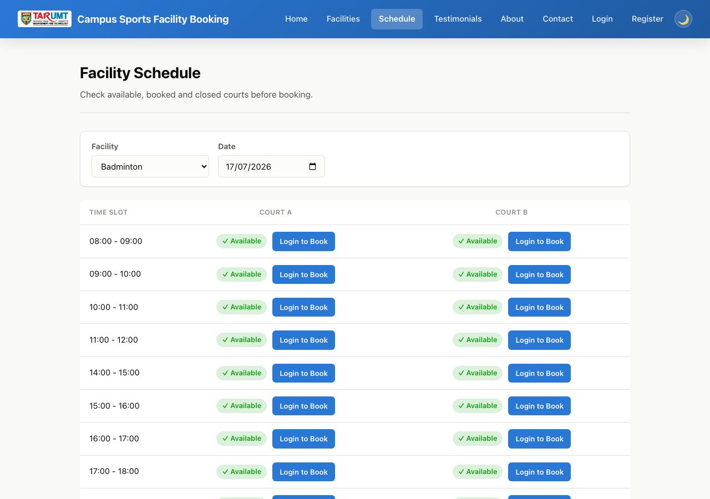
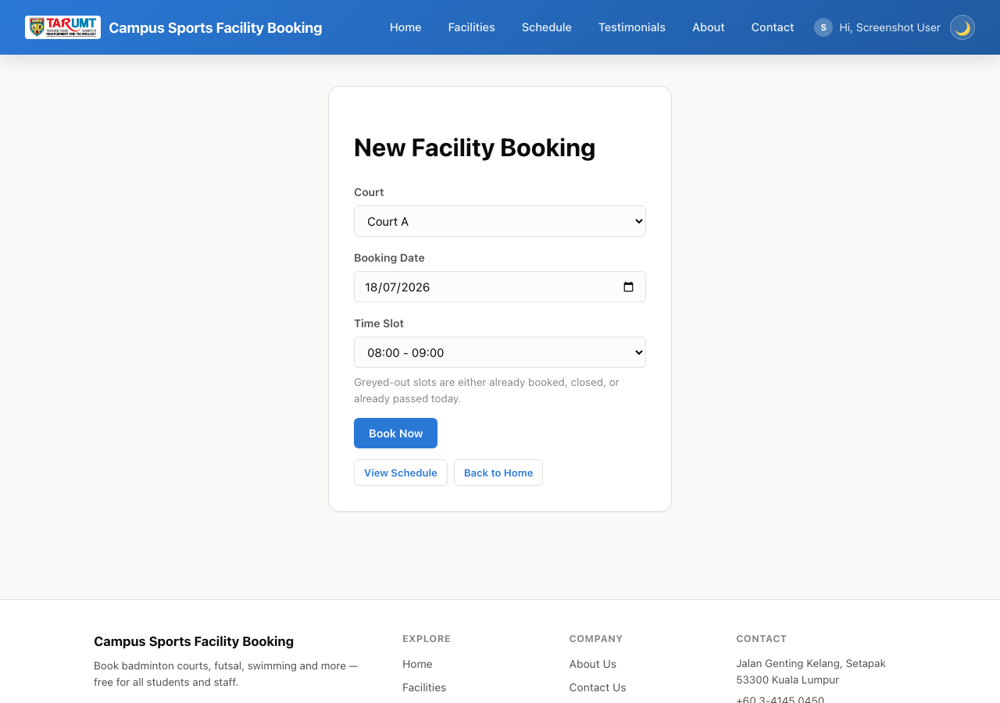

# Campus Sports & Facilities Amenities — Booking Platform

A minimal PHP + MySQL CRUD web app for the **AMIT3253 Cloud Computing for Business**
capstone assignment. Students browse sports facilities (badminton courts, bowling
lanes, table tennis, etc.), check a live availability schedule, and book a time
slot. Use this folder as-is as your Phase 2/3 starting point so you can focus on the
AWS infrastructure (VPC, EC2, RDS, ELB, ASG) instead of writing app code from
scratch.


*Homepage — browse facilities as photo cards.*


*`schedule.php` — availability grid for a facility's courts by date.*


*Booking form — already-booked/closed/past time slots are greyed out before you submit.*

This is the most feature-complete of the five scenario folders — treat it as a
reference for how far you *could* take a scenario, not the bar every group needs to
hit.

## Features

**Public site**
- Browse facilities as photo cards, with search/filter on the homepage.
- Facility detail page with photo + optional court-layout diagram.
- **`schedule.php`** — pick a facility and date to see a grid of every court's time
  slots (Available / Booked / Booked by you / Closed with reason). Available cells
  link straight into the booking form pre-filled.
- Book a specific court + date + time slot; the database enforces one booking per
  court/date/slot (`UNIQUE` constraint), so double-booking is impossible even under
  concurrent requests. The time slot dropdown also greys out (and disables) slots
  that are already booked, closed, or already passed today as soon as a court and
  date are picked — a small fetch to **`slot_availability.php`** (no page reload).
- Booking date defaults to today and cannot be set in the past (checked both in the
  browser and on the server). For today specifically, time slots that have already
  started are also greyed out and rejected server-side if submitted anyway, via the
  `is_slot_in_past()` helper in `helpers.php`.
- "My Bookings" on the homepage, with edit/cancel for your own bookings.
- Register/login/logout, account page, dark/light mode, password visibility toggle,
  TARUMT faculty dropdown at registration.
- In-app notifications (e.g. booking confirmed, closure affecting your booking).
- Contact form and testimonials (reviews), both moderated by admin.

**Admin panel** (`admin/`, gated by an `is_admin` flag — admins land directly on
`admin/facilities.php`, never the public site)
- Full CRUD for facilities (name, description, photo, layout diagram).
- CRUD for courts within a facility (a facility is a sport/category; a court is the
  specific bookable instance — e.g. Bowling has Lane 1–4).
- View/cancel any user's booking.
- **`admin/schedule.php`** — the same availability grid the public site has, but
  admin-only: booked cells show the actual booker's name and email (the public
  version only ever shows "Booked", never who), so an admin can see who's using a
  court at a glance instead of cross-referencing `admin/bookings.php`'s flat list.
- Closures — mark a court closed for a slot or a whole day (e.g. maintenance);
  `schedule.php` and the booking form respect this automatically.
- Moderate testimonials and view contact messages.
- Manage user accounts: promote/demote admin access, delete an account (cascades — deleting a user also deletes all of their bookings/orders/tickets and testimonials in the same transaction, so there's nothing left over to clean up manually), or create a brand-new admin account directly (`admin/user_create.php`) without needing that person to self-register first. An admin can never delete or demote their own account.

**Adding a brand-new sport needs zero code changes** — create one facility (with its
first court) via `admin/facility_create.php`, then add more courts on
`admin/facility_edit.php`. Every page reads courts generically off whichever facility
they belong to.

There's deliberately **no admin dashboard** (`admin/index.php`) — stats tiles
(facility count, bookings today, etc.) are left as an exercise using the same
query/render patterns as the other admin pages.

## Tech stack

Plain procedural PHP (no framework) + MySQL via `mysqli`. All queries use prepared
statements and all output is escaped with `htmlspecialchars()` — these are safe
patterns to reuse elsewhere in your project.

## Requirements

- PHP 8.x with the `mysqli` extension
- MySQL 5.7+ / MariaDB / Amazon RDS (MySQL-compatible)
- A web server (Apache/Nginx) or just `php -S` for local testing

## Quick start (local)

1. Create the database and import the schema (this also seeds an admin account and
   some sample facilities/courts/time slots):
   ```
   mysql -u root -p -e "CREATE DATABASE sports_booking_db"
   mysql -u root -p sports_booking_db < schema.sql
   ```
2. Point `config.php` at your MySQL instance — either edit the fallback values
   directly, or export environment variables before starting PHP:
   ```
   DB_HOST=localhost DB_USER=root DB_PASS=yourpassword DB_NAME=sports_booking_db
   ```
3. Serve the folder, e.g.:
   ```
   php -S localhost:8000
   ```
4. Visit `http://localhost:8000/` for the public site, or log in with the seeded
   admin account below to reach the admin panel.

## Default admin login

```
Email:    admin@example.com
Password: admin123
```

**Change this password (or the seed row in `schema.sql`) before deploying anywhere
beyond a local demo** — it's a well-known credential once this code is shared.
Regular users register their own accounts via the Register page.

## Project structure

| Path | Purpose |
|---|---|
| `schema.sql` | Creates the database, all tables, and seed data |
| `config.php` | Database connection — reads `DB_HOST`/`DB_USER`/`DB_PASS`/`DB_NAME`, plus S3 photo storage config |
| `healthz.php` | ALB health check target — `200` if the DB connection works, `500` otherwise |
| `auth.php` | Session helpers: `current_user_id()`, `require_login()`, `require_admin()`, etc. |
| `helpers.php` | Image upload/delete helpers, faculty list, entity image URL resolver |
| `register.php` / `login.php` / `logout.php` | Account creation and session login (passwords hashed, never plaintext) |
| `index.php` | Public landing page — facility cards + "My Bookings" |
| `schedule.php` | Availability grid by facility + date |
| `create.php` / `edit.php` / `delete.php` | Booking CRUD, requires login + ownership |
| `slot_availability.php` | JSON endpoint the booking form fetches to grey out unavailable time slots |
| `facilities.php`, `about.php`, `contact.php`, `testimonials.php` | Public informational pages |
| `partials/header.php` / `partials/footer.php` | Shared navbar/footer, included by every page |
| `admin/` | Admin-only CRUD for facilities, courts, bookings, closures, testimonials, messages, users |
| `uploads/` | Uploaded facility photos and layout diagrams |
| `style.css` | Shared styling (navbar, cards, forms, tables, dark/light mode) |

## Facility photos: local disk by default, S3 already wired up (just needs your bucket)

Uploads are validated with `getimagesize()` (not just the file extension) and capped
at 5MB. Where they're stored depends on `AWS_S3_BUCKET` in `config.php`:
- **Unset (default)**: saved into `uploads/`, `facilities.image_url` stores a path
  like `/uploads/facility_xxx.jpg`. Nothing to configure.
- **Set**: uploaded to that S3 bucket instead (hand-written Signature Version 4
  signing over PHP's built-in stream wrapper — no AWS SDK, no Composer), and
  `image_url` stores the full object URL.

Credentials are tried two ways: first an IAM role attached to the EC2 instance (via
the metadata service, nothing hardcoded), and if that's not available — e.g. an AWS
Academy Learner Lab where you can't attach or inspect IAM roles yourself — explicit
`AWS_ACCESS_KEY_ID`/`AWS_SECRET_ACCESS_KEY`/`AWS_SESSION_TOKEN`. Set these in a
`.env` file (copy `.env.example` to `.env`, fill in the values from the lab's "AWS
Details" panel — `.env` is git-ignored, so it's never committed to this public repo),
or as Apache environment variables if you'd rather not use a file. Those temporary
credentials expire and rotate periodically — if uploads that were working suddenly
fail, refresh them and, if using `.env`, no restart is needed.

This matters once there's more than one EC2 instance behind the ALB — a photo saved to
local disk only exists on whichever instance handled the upload, so any other instance
shows a broken image for it. **What's still on you**: creating the bucket + a public-read
bucket policy (or CloudFront), getting one of the two credential methods above working,
and setting `AWS_S3_BUCKET`/`AWS_S3_REGION`. The signing logic is verified against AWS's
own SigV4 test vectors, the local-disk path is tested live end-to-end, and a signed
request with fake credentials was confirmed to reach a real S3 endpoint and get a
structured `403` back (not a crash/hang) — but a full successful round-trip against a
real bucket with real credentials hasn't been tested, since there wasn't one available
here.

Notes for EC2 deployment:
- `uploads/` needs to be writable by the web server user: `chmod 775 uploads` after
  copying the app to `/var/www/html/`.
- PHP's default `upload_max_filesize` (often 2M) is smaller than the 5MB this app
  allows — bump it in `php.ini`:
  ```
  upload_max_filesize = 10M
  post_max_size = 12M
  ```
  then restart the web server.
- Point your ALB target group's health check at `healthz.php` — it returns `200` only
  if the database connection actually succeeds (`500` otherwise), so a target that
  can't reach RDS gets correctly pulled out of rotation instead of still receiving
  traffic.

## Phase 2: running it on a single EC2 instance

1. **Launch the instance**: EC2 console → Launch Instance → Amazon Linux 2023 AMI,
   `t2.micro`/`t3.micro` (free-tier eligible). Create or select a key pair (download
   the `.pem` if new) — you'll need it to SSH in.
2. **Security group**: allow inbound `SSH (22)` from your IP only, and `HTTP (80)`
   from `0.0.0.0/0` (the assignment's assumptions say HTTPS isn't required for this
   proof of concept). Leave all other ports closed.
3. **Connect via SSH** once the instance is "running" and you have its public IPv4
   address:
   ```
   chmod 400 your-key.pem
   ssh -i your-key.pem ec2-user@<public-ipv4>
   ```
4. **Install a LAMP stack** on the instance:
   ```
   sudo dnf install -y httpd php php-mysqli mariadb105-server
   sudo systemctl enable --now httpd mariadb
   ```
5. **Copy this folder onto the instance** (run from your local machine, not the SSH
   session):
   ```
   scp -i your-key.pem -r ./sports-facility-booking ec2-user@<public-ipv4>:/tmp/
   ```
   Then on the instance:
   ```
   sudo cp -r /tmp/sports-facility-booking/* /var/www/html/
   sudo chown -R apache:apache /var/www/html
   sudo chmod -R 775 /var/www/html/uploads
   ```
6. **Secure MySQL/MariaDB**, create a DB user, then import the schema:
   ```
   sudo mysql_secure_installation
   mysql -u root -p < schema.sql
   ```
7. **Point the app at the database**: copy `.env.example` to `.env` and set
   `DB_HOST`/`DB_USER`/`DB_PASS`/`DB_NAME` there to match your MySQL
   credentials (`config.php` loads `.env` automatically - see the loader at
   the top of the file; `.env` is git-ignored so it's never committed). Or,
   if you'd rather not use a file, edit `config.php` directly, or export the
   same names as Apache environment variables via a `SetEnv` directive in
   `/etc/httpd/conf.d/`.
8. **Test it**: open `http://<public-ipv4>/` in a browser.

## Phase 3: moving the database to RDS

1. Create an RDS MySQL instance in a private subnet (per the assignment's VPC
   design).
2. From an EC2 instance in the same VPC, run `schema.sql` against the RDS endpoint:
   ```
   mysql -h <rds-endpoint> -u <user> -p < schema.sql
   ```
3. Set `DB_HOST` (and `DB_USER`/`DB_PASS`/`DB_NAME` if different) on the web server
   to the RDS endpoint — `config.php` does not need to change.
4. Restrict the RDS security group to only accept traffic from the web/app tier's
   security group, on port 3306.

## A note on authentication and the assignment brief

The assignment's own assumptions state the platform "is publicly accessible to
end-users without requiring a user login, registration, or authentication
gateway" — login/registration is **not** required to satisfy the "Functional"
rubric criterion. It's included here because it makes the demo feel like a real
product and is a reasonable "advanced feature" to point to in the Part 2
demonstration. If you'd rather keep things simpler, you can delete `auth.php`,
`register.php`, `login.php`, `logout.php`, the `require_login()` calls, and the
`user_id` column/joins — the CRUD logic underneath is unaffected either way.

## Extending for extra marks

This app already covers CRUD, accounts, a full admin panel, a schedule grid,
closures, image uploads, and notifications. Ideas for going further:
- An admin dashboard: stats tiles (facility count, bookings today, total bookings)
  plus a graph of bookings over time (bookings per day/week, and per facility) so an
  admin can spot which sports/courts are busiest.
- A booking status workflow (pending/confirmed/done) instead of instant-confirm.
- Live chat between a user and admin (not a chatbot — a real-time message thread) for support questions, e.g. a `messages` table keyed by conversation with sender/recipient, polled or long-polled for new messages.
- Cap how much time a single account can book per day (e.g. no more than 2 hours' worth of time slots across all courts/facilities combined), so one account can't hog every slot.
- Wire facility photo uploads to Amazon S3 (see above).
- A REST/JSON API layer for load testing tools (Apache Bench, JMeter, Locust) to hit
  directly.
