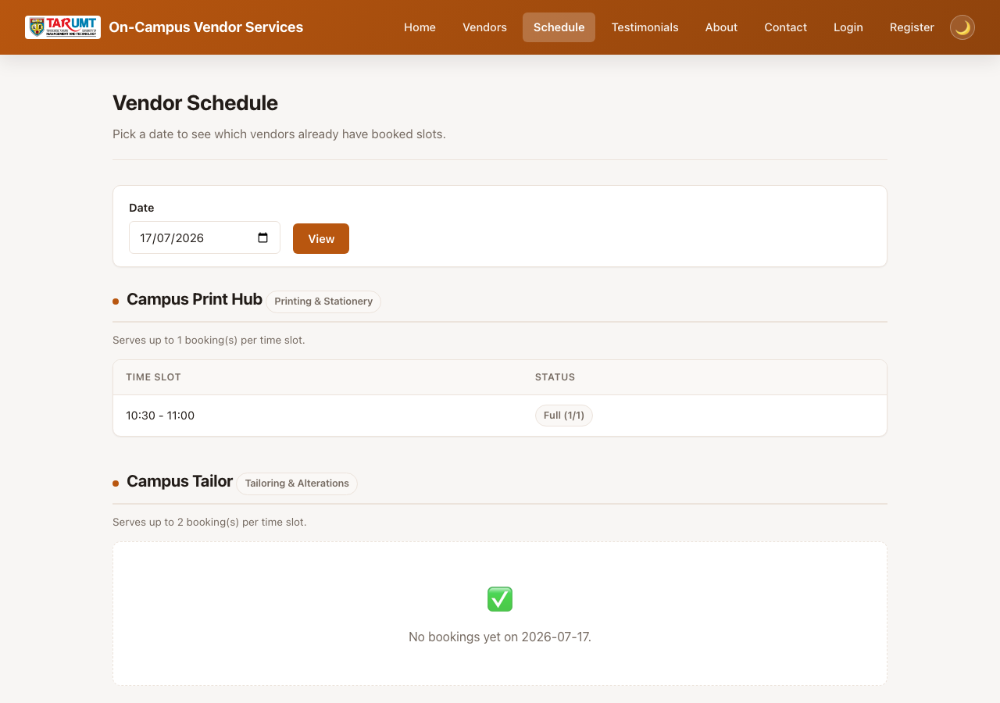
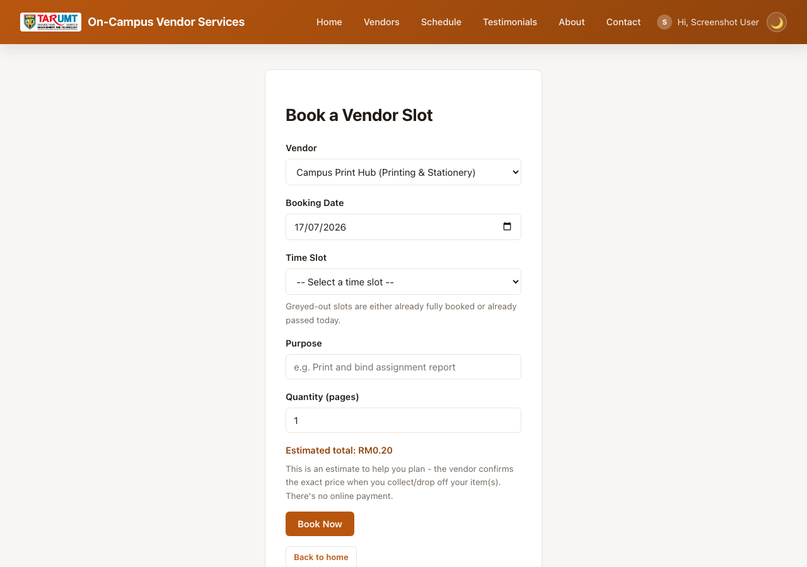

# On-Campus Commercial & Vendor Services Booking Platform

A minimal PHP + MySQL CRUD web app for the **AMIT3253 Cloud Computing for Business**
capstone assignment. Students browse on-campus vendors (printing, laundry, tailor,
tech repair, etc.) and book a service slot. Use this folder as-is as your Phase
2/3 starting point so you can focus on the AWS infrastructure (VPC, EC2, RDS, ELB,
ASG) instead of writing app code from scratch.


*Homepage — browse vendors as photo cards, with a price-per-unit tag.*


*`schedule.php` — booked-vs-capacity per slot for a chosen vendor and date.*


*Booking form — live price estimate as you set a quantity; full/past slots are greyed out.*

## Features

**Public site**
- Browse vendors as photo cards, with search on the homepage.
- Book a vendor for a date + time slot, picked from a fixed dropdown of 30-minute
  slots (not free text), plus a short purpose/description of the job. Each vendor
  has a `capacity` (how many students it can serve in the same slot — a print
  counter can realistically handle more people at once than a 1-on-1 tailor
  fitting), checked concurrency-safely (`SELECT ... FOR UPDATE` on the vendor row +
  a count of existing bookings for that slot vs. capacity, inside a transaction) so
  two people booking at the same instant can't both slip past a full slot. Once a
  slot hits capacity, the next attempt gets a friendly "fully booked" error instead
  of a silent overbooking. The time slot dropdown also greys out (and disables)
  already-full slots as soon as a vendor and date are chosen — a small fetch to
  **`slot_availability.php`** (a tiny JSON endpoint, no page reload) - so students
  see it's full before they try, not just after submitting.
- Booking date defaults to today and cannot be set in the past (checked both in the
  browser and on the server). For today specifically, time slots that have already
  started are also greyed out and rejected server-side if submitted anyway — the
  same `is_slot_in_past()` check the greyed-out UI uses.
- **Quantity-based price estimate.** Each vendor has a `price_per_unit` and
  `unit_label` (e.g. RM0.20/page, RM5.00/kg, RM15.00/item) shown on every vendor
  card. The booking form asks for a quantity and shows a live-computed estimated
  total as you type, stored on the booking (`quantity`, `estimated_total`) and
  recalculated server-side on save so it can't be tampered with client-side.
  Deliberately **not** a checkout/payment page like `event-ticketing/payment.php` —
  these are real-world pay-on-collection services (you pay the vendor in person when
  you drop off/collect your item), so the price is a heads-up estimate, not an
  online transaction.
- "My Bookings" on the homepage, with edit/cancel for your own bookings.
- Register/login/logout, account page, dark/light mode, password visibility toggle,
  TARUMT faculty dropdown at registration.
- Contact form and testimonials (reviews), both moderated by admin.

**Admin panel** (`admin/`, gated by an `is_admin` flag — admins land directly on
`admin/vendors.php`, never the public site)
- Full CRUD for vendors: name, category, description, photo, price per unit, unit
  label, and capacity per slot.
- View/cancel any user's booking, including its quantity and estimated total.
- **`admin/schedule.php`** — the same per-date "which vendors are booked, and how
  full each slot is" view as the public site, but admin-only: shows the actual
  booker's name, email, and purpose for each booking (the public version only ever
  shows a slot's booked-count vs. capacity, never who).
- Moderate testimonials and view contact messages.
- Manage user accounts: promote/demote admin access, delete an account (cascades — deleting a user also deletes all of their bookings/orders/tickets and testimonials in the same transaction, so there's nothing left over to clean up manually), or create a brand-new admin account directly (`admin/user_create.php`) without needing that person to self-register first. An admin can never delete or demote their own account.

There's deliberately **no admin dashboard** (`admin/index.php`) — that's left as an
exercise using the same query/render patterns as the other admin pages.

## Tech stack

Plain procedural PHP (no framework) + MySQL via `mysqli`. All queries use prepared
statements and all output is escaped with `htmlspecialchars()` — these are safe
patterns to reuse elsewhere in your project.

## Requirements

- PHP 8.x with the `mysqli` extension
- MySQL 5.7+ / MariaDB / Amazon RDS (MySQL-compatible)
- A web server (Apache/Nginx) or just `php -S` for local testing

## Quick start (local)

1. Create the database and import the schema (this also seeds an admin account and
   some sample vendors):
   ```
   mysql -u root -p -e "CREATE DATABASE vendor_services_db"
   mysql -u root -p vendor_services_db < schema.sql
   ```
2. Point `config.php` at your MySQL instance — either edit the fallback values
   directly, or export environment variables before starting PHP:
   ```
   DB_HOST=localhost DB_USER=root DB_PASS=yourpassword DB_NAME=vendor_services_db
   ```
3. Serve the folder, e.g.:
   ```
   php -S localhost:8000
   ```
4. Visit `http://localhost:8000/` for the public site, or log in with the seeded
   admin account below to reach the admin panel.

## Default admin login

```
Email:    admin@example.com
Password: admin123
```

**Change this password (or the seed row in `schema.sql`) before deploying anywhere
beyond a local demo** — it's a well-known credential once this code is shared.
Regular users register their own accounts via the Register page.

## Project structure

| Path | Purpose |
|---|---|
| `schema.sql` | Creates the database, all tables, and seed data |
| `config.php` | Database connection — reads `DB_HOST`/`DB_USER`/`DB_PASS`/`DB_NAME` |
| `auth.php` | Session helpers: `current_user_id()`, `require_login()`, `require_admin()`, etc. |
| `helpers.php` | Image upload/delete helpers, faculty list, time slot list, entity image URL resolver |
| `register.php` / `login.php` / `logout.php` | Account creation and session login (passwords hashed, never plaintext) |
| `index.php` | Public landing page — vendor cards + "My Bookings" |
| `create.php` / `edit.php` / `delete.php` | Booking CRUD, requires login + ownership |
| `vendors.php`, `about.php`, `contact.php`, `testimonials.php` | Public informational pages |
| `partials/header.php` / `partials/footer.php` | Shared navbar/footer, included by every page |
| `admin/` | Admin-only CRUD for vendors, bookings, testimonials, messages, users |
| `uploads/` | Uploaded vendor photos |
| `style.css` | Shared styling (navbar, cards, forms, tables, dark/light mode) |

## Vendor photos: local uploads now, S3 as an exercise

`vendors.image_url` stores a path like `/uploads/vendor_xxx.jpg`. Uploads are
validated with `getimagesize()` (not just the file extension), capped at 5MB, and
saved into `uploads/`. **Deliberately not wired to Amazon S3** — that's a natural
next exercise: swap `move_uploaded_file()` for an S3 `PutObject` call and store the
resulting object URL in the same `image_url` column; the `` rendering doesn't
need to change either way.

Notes for EC2 deployment:
- `uploads/` needs to be writable by the web server user: `chmod 775 uploads` after
  copying the app to `/var/www/html/`.
- PHP's default `upload_max_filesize` (often 2M) is smaller than the 5MB this app
  allows — bump it in `php.ini`:
  ```
  upload_max_filesize = 10M
  post_max_size = 12M
  ```
  then restart the web server.

## Phase 2: running it on a single EC2 instance

1. **Launch the instance**: EC2 console → Launch Instance → Amazon Linux 2023 AMI,
   `t2.micro`/`t3.micro` (free-tier eligible). Create or select a key pair (download
   the `.pem` if new) — you'll need it to SSH in.
2. **Security group**: allow inbound `SSH (22)` from your IP only, and `HTTP (80)`
   from `0.0.0.0/0` (the assignment's assumptions say HTTPS isn't required for this
   proof of concept). Leave all other ports closed.
3. **Connect via SSH** once the instance is "running" and you have its public IPv4
   address:
   ```
   chmod 400 your-key.pem
   ssh -i your-key.pem ec2-user@<public-ipv4>
   ```
4. **Install a LAMP stack** on the instance:
   ```
   sudo dnf install -y httpd php php-mysqli mariadb105-server
   sudo systemctl enable --now httpd mariadb
   ```
5. **Copy this folder onto the instance** (run from your local machine, not the SSH
   session):
   ```
   scp -i your-key.pem -r ./vendor-services-booking ec2-user@<public-ipv4>:/tmp/
   ```
   Then on the instance:
   ```
   sudo cp -r /tmp/vendor-services-booking/* /var/www/html/
   sudo chown -R apache:apache /var/www/html
   sudo chmod -R 775 /var/www/html/uploads
   ```
6. **Secure MySQL/MariaDB**, create a DB user, then import the schema:
   ```
   sudo mysql_secure_installation
   mysql -u root -p < schema.sql
   ```
7. **Point the app at the database**: edit `config.php` (or export
   `DB_HOST`/`DB_USER`/`DB_PASS`/`DB_NAME` in Apache's environment, e.g. via a
   `SetEnv` directive in `/etc/httpd/conf.d/`) to match your MySQL credentials.
8. **Test it**: open `http://<public-ipv4>/` in a browser.

## Phase 3: moving the database to RDS

1. Create an RDS MySQL instance in a private subnet (per the assignment's VPC
   design).
2. From an EC2 instance in the same VPC, run `schema.sql` against the RDS endpoint:
   ```
   mysql -h <rds-endpoint> -u <user> -p < schema.sql
   ```
3. Set `DB_HOST` (and `DB_USER`/`DB_PASS`/`DB_NAME` if different) on the web server
   to the RDS endpoint — `config.php` does not need to change.
4. Restrict the RDS security group to only accept traffic from the web/app tier's
   security group, on port 3306.

## A note on authentication and the assignment brief

The assignment's own assumptions state the platform "is publicly accessible to
end-users without requiring a user login, registration, or authentication
gateway" — login/registration is **not** required to satisfy the "Functional"
rubric criterion. It's included here because it makes the demo feel like a real
product and is a reasonable "advanced feature" to point to in the Part 2
demonstration. If you'd rather keep things simpler, you can delete `auth.php`,
`register.php`, `login.php`, `logout.php`, the `require_login()` calls, and the
`user_id` column/joins — the CRUD logic underneath is unaffected either way.

## Extending for extra marks

This app covers CRUD, accounts, a baseline admin panel, double-booking prevention,
and a quantity-based price estimate. Ideas for going further:
- An admin dashboard: stats tiles (total bookings, bookings today, busiest vendor)
  plus a graph of bookings over time, broken down per vendor/category, so an admin
  can spot demand trends.
- A booking status workflow (pending/confirmed/done) instead of instant-confirm.
- Live chat between a user and admin (not a chatbot — a real-time message thread) for support questions, e.g. a `messages` table keyed by conversation with sender/recipient, polled or long-polled for new messages.
- Cap how much time a single account can book per day (e.g. no more than 2 hours' worth of vendor time slots combined), so one account can't hog every slot.
- Wire vendor photo uploads to Amazon S3 (see above).
- A REST/JSON API layer for load testing tools (Apache Bench, JMeter, Locust) to hit
  directly.
